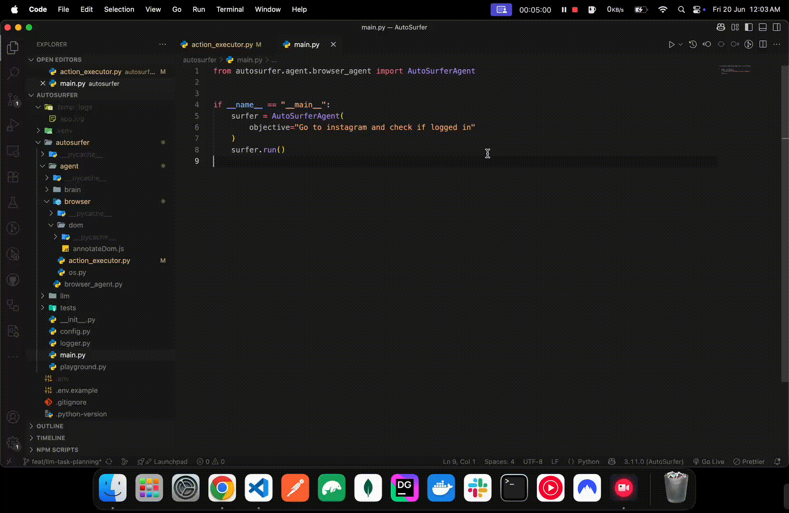

# 🌍 AutoSurfer

**AutoSurfer** is an open-source platform where autonomous AI agents live digital lives.
These agents don't just automate tasks — they feel, think, and evolve as they surf the web like real humans.

## Demo



## 🚀 What Is AutoSurfer?

AutoSurfer is the foundation for building **lifelike AI browser agents** that can:

- 🔍 Perceive and interact with websites like a human user
- 🎯 Pursue specific goals autonomously (e.g., research, posting, filling forms)
- 🧠 Develop a **persona** with evolving memory and behavior
- 😌 Express a **mood** that changes daily based on their digital experiences
- 🧬 Simulate lifelike usage patterns (scrolling, mouse movement, hesitations)

It's not just a bot. It's a digital entity.

---

## ✨ Features

| Feature                       | Status        | Description                                                           |
| ----------------------------- | ------------- | --------------------------------------------------------------------- |
| **Browser Agent**             | ✅ Done       | Playwright-powered browser controlled by Python agent                 |
| **DOM Annotation**            | ✅ Done       | Highlights and identifies all interactive UI elements                 |
| **LLM-Driven Thinking**       | 🛠 In Progress | Agents use LLMs to plan next steps based on current and prior context |
| **Task Memory**               | ✅ Done       | Agent tracks task history and remembers the overall objective         |
| **Sequential Task Execution** | 🛠 In Progress | Agent completes one task at a time with deliberate reasoning          |
| **Captcha Handling**          | ✅ Basic      | Detects captchas once per page and halts tasks                        |
| **Emotional Engine**          | 🔜 Planned    | Mood and emotion simulation based on web experience                   |
| **Persona Generator**         | 🔜 Planned    | Create agents with unique backstories, preferences, and voices        |

---

## 📦 Tech Stack

- **Python 3.11+** — Core runtime
- **Playwright** — Headless/full-browser automation
- **OpenAI / Vision Models** (planned) — For reasoning and perception
- **JavaScript** — For DOM annotation and interaction overlay

---

## 🧠 Agent Philosophy

AutoSurfer agents are inspired by real human traits:

- **Curiosity**: They explore based on goals, not rigid instructions.
- **Emotion**: They might feel excited after visiting an inspiring site, or bored with repetitive tasks.
- **Growth**: They retain memory, adapt behavior, and evolve like digital creatures.

---

## 🔧 Getting Started

```bash
# 1. Install dependencies
uv sync

# 2. Run the agent (dev mode)
make dev
```

Or install manually:

```bash
python -m venv .venv && source .venv/bin/activate
pip install -r pyproject.toml
# Playwright requires a one-time browser download
playwright install
```

Logs are written to `.temp/logs/app.log`; task memories persist in `.temp/memory/` as JSON.

---

## 🌟 Why Contribute?

AutoSurfer isn't just a dev tool — it's a movement to bring lifelike AI to the open web.
By contributing, you're helping build a new generation of agents that live, work, and evolve online.

Whether you're a researcher, hacker, designer, or writer — **we welcome your magic.**

---

## 🛠️ Contributing

Coming soon! For now, feel free to fork the repo, star it, and suggest features or bugfixes via Issues.

---

## 📣 Spread the Word

If you believe in agents that _feel human_, share the project on:

- Twitter
- Reddit
- Hacker News
- Your blog ❤️

---

## 🔭 Autonomy Roadmap (Major Upcoming Work)

- **DOM enrichment** – expose more attributes (aria-label, role, alt, size) so the LLM can pick reliable selectors.
- **Vision-based click fallback** – use lightweight template matching when DOM selectors fail.
- **Loop/repeat action support** – let the LLM specify repetitive actions succinctly (e.g., comment on first N posts).
- **Secure credential handling** – inject creds from env/vault after the LLM response so secrets never leave the machine.
- **Selector robustness** – better handle dynamic class names, SVG icons, and nested components.
- **Event-driven captcha detection** – hook into page navigation/load events instead of polling each loop.

---

## 🔑 Environment Variables

Set secrets before running:

```bash
export OPENAI_API_KEY="sk-..."
export BROWSER_PROVIDER="playwright"  # or "browserbase"
```

---

## 🏃 Quick Usage Example

```python
from autosurfer.agent.browser_agent import AutoSurferAgent
from autosurfer.agent.browser.adapters import BrowserSettings, create_browser_adapter

# Create browser session first
settings = BrowserSettings(headless=True, stealth_mode=True)
browser_session = create_browser_adapter("playwright", settings)

# Pass browser session to agent
agent = AutoSurferAgent(
    objective="Go to https://example.com and click 'More information...'",
    browser_session=browser_session,
    enable_memory=True,
)
agent.run()

# Use BrowserBase
settings = BrowserSettings(headless=True)
browser_session = create_browser_adapter("browserbase", settings)
agent = AutoSurferAgent(
    objective="Go to https://example.com and click 'More information...'",
    browser_session=browser_session,
    enable_memory=True,
)
agent.run()
```

---

## 📂 Example Scripts

| Script                                 | Purpose                                                                   |
| -------------------------------------- | ------------------------------------------------------------------------- |
| `examples/launch_browser.py`           | Opens a Playwright browser with annotation overlay for manual exploration |
| `examples/test_agent_memory.py`        | Demonstrates the agent with and without task memory                       |
| `examples/test_browser_agents.py`      | Runs multiple agents in parallel for stress-testing                       |
| `examples/test_captcha_detection.py`   | Shows basic captcha detection workflow                                    |
| `examples/test_browserbase_adapter.py` | Demonstrates BrowserBase adapter usage and comparison with Playwright     |

Run the memory-enabled demo:

```bash
python -m examples.test_agent_memory enabled
```

Test BrowserBase adapter:

```bash
python -m examples.test_browserbase_adapter
```

---

## 🪪 License

AutoSurfer is open-source under the MIT License. See `LICENSE` for details.
